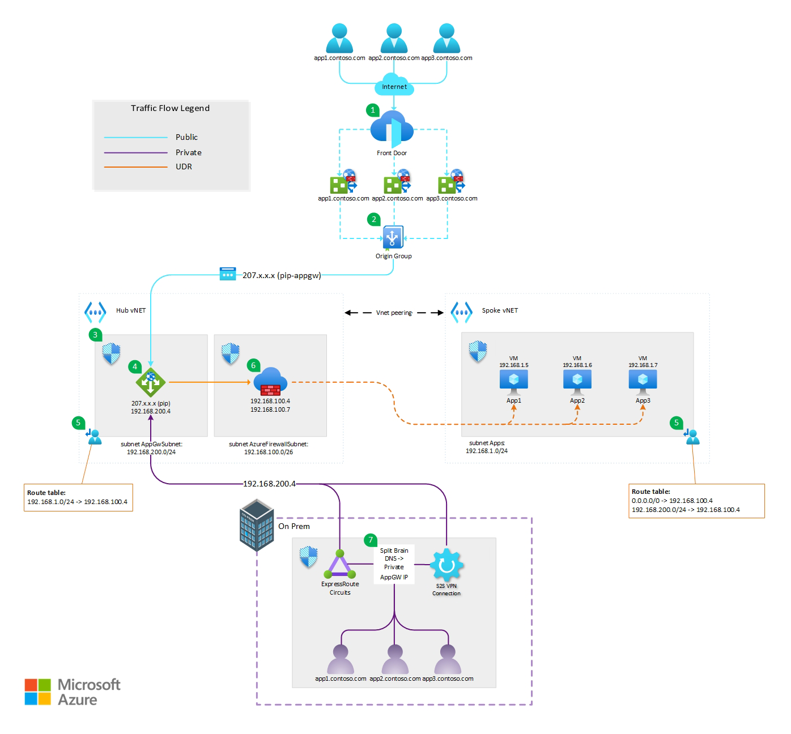

<!-- Use the aac-browse-header.yml   -->

This article describes an architecture that enables multi-site, split brain DNS application hosting with applications being hosted on separate virtual machines all configured with a unique subdomain off a primary apex domain. All while ensuring network traffic between the Application Gateway and the backend application servers (VMs) flows through an Azure Firewall. Azure Front Door is used for external users and Application Gateway for internal users. This architecture provides high availability, scalability, and security for web applications hosted on Azure.

## Architecture

*Download a [Visio file](https://arch-center.azureedge.net/[file-name].vsdx) of this architecture.*

### Workflow

The following workflow (or dataflow) corresponds to the above diagram:
1. External users access the web application through Azure Front Door, which acts as a global load balancer and web application firewall. Azure Front Door routes the requests based on the client HOST HEADER to the Origin Group.
2. The Origin Group is configured to point to the Application Gateway while leaving the HOST HEADER unaltered. This is required so the Application Gateway can properly route the incoming requests to the various backend pools.
3. A Network Security Group (NSG) is configured on the Application Gateway subnet to only allow incoming requests from the AzureFrontDoor.Backend service tag. This ensures that public traffic cannot hit the Public IP (pip) directly.
4. The build pipeline runs on the PR.

### Components

  - [Azure Front Door](https://azure.microsoft.com/services/frontdoor): Azure Front Door is a global load balancer and web application firewall that provides fast and secure delivery of web applications to users around the world. It is used in this architecture to route the external users to the closest Application Gateway instance and protect the web application from common web attacks.
  - [Application Gateway](https://azure.microsoft.com/services/application-gateway): Application Gateway is a regional load balancer and web application firewall that provides high availability, scalability, and security for web applications. It is used in this architecture to route the requests from both external and internal users to the back-end web servers and protect the web application from common web attacks.
  - [Azure Firewall](https://azure.microsoft.com/services/azure-firewall): Azure Firewall is a cloud-based network security service that filters and logs the traffic between different subnets and networks. It is used in this architecture to control and monitor the traffic between Application Gateway and the back-end web servers, and to perform NAT for the outbound traffic from the web servers to the internet.
  - [Azure Virtual Machines](https://azure.microsoft.com/services/virtual-machines): Azure Virtual Machines are on-demand, scalable, and configurable compute resources that run the web application code. They are used in this architecture to host the back-end web servers in an availability set, which provides high availability and fault tolerance.
  - [Azure ExpressRoute](https://learn.microsoft.com/en-us/azure/expressroute/expressroute-introduction): ExpressRoute lets you extend your on-premises networks into the Microsoft cloud over a private connection with the help of a connectivity provider. In this architecture it is one of the options to facilitate private connectivity to the Application Gateway for on premise users.
  
### Alternatives

Some possible alternatives for this architecture are:
  - [Azure Traffic Manager](https://azure.microsoft.com/services/traffic-manager): Azure Traffic Manager is a DNS-based traffic routing service that distributes the traffic across different regions and endpoints. It could be used instead of Azure Front Door to route the external users to the closest Application Gateway instance. However, Azure Front Door provides additional features such as web application firewall, URL rewriting, and session affinity, which are not available in Azure Traffic Manager.
  - [Azure Load Balancer](https://azure.microsoft.com/services/load-balancer): Azure Load Balancer is a network load balancer that provides high availability and scalability for TCP and UDP traffic. It could be used instead of Application Gateway to distribute the requests from both external and internal users to the back-end web servers. However, Application Gateway provides additional features such as web application firewall, SSL termination, and cookie-based session affinity, which are not available in Azure Load Balancer.
  - [Azure App Service](https://azure.microsoft.com/services/app-service): Azure App Service is a fully managed platform for hosting web applications without managing the underlying infrastructure25. It could be used instead of Azure Virtual Machines to host the back-end web servers. However, Azure Virtual Machines provide more flexibility and control over the web server configuration and deployment, which might be required for some web applications.

## Scenario details

This scenario was built to solve the problem of hosting a web application that needs to serve both external and internal users with high availability, scalability, and security. The customer’s goals are to:

 - Provide fast and reliable access to the web application for users around the world.
 - Use the same apex domain name and URL for both external and internal users, without exposing the internal IP addresses to the internet while routing subdomains to different applications hosted on separate virtual machines.
 - Protect the web application from common web attacks and malicious traffic.
 - Control and monitor all network traffic between the Application Gateway and the backend virtual machines.
 - Ensure the availability and fault tolerance of the web application.

### Potential use cases

> What industry is the customer in? Use the following industry keywords, when possible, to get the article into the proper search and filter results: retail, finance, manufacturing, healthcare, government, energy, telecommunications, education, automotive, nonprofit, game, media (media and entertainment), travel (includes hospitality, like restaurants), facilities (includes real estate), aircraft (includes aerospace and satellites), agriculture, and sports. 
>   Are there any other use cases or industries where this would be a fit?
>   How similar or different are they to what's in this article?

## Considerations

These considerations implement the pillars of the Azure Well-Architected Framework, which is a set of guiding tenets that can be used to improve the quality of a workload. For more information, see [Microsoft Azure Well-Architected Framework](/azure/architecture/framework).

> Are there any lessons learned from running this that would be helpful for new customers?  What went wrong when building it out?  What went right?
> How do I need to think about managing, maintaining, and monitoring this long term?

> REQUIREMENTS: 
>   You must include the "Cost optimization" section. 
>   You must include at least two of the other H3 sub-sections/pillars: Reliability, Security, Operational excellence, and Performance efficiency.

### Reliability

Reliability ensures your application can meet the commitments you make to your customers. For more information, see [Overview of the reliability pillar](/azure/architecture/framework/resiliency/overview).

 - **Virtual machines**: You can use [Availability Sets](https://learn.microsoft.com/en-us/azure/virtual-machines/availability-set-overview) to distribute your virtual machines across multiple fault domains and update domains within a single datacenter. You can also use [Availability Zones](https://learn.microsoft.com/en-us/azure/reliability/availability-zones-overview) to distribute your virtual machines across multiple physically isolated datacenters within a region.
  - **Application Gateway**: Azure Application Gateways are always deployed in a highly available fashion. The service is made up of multiple instances that are created as configured if autoscaling is disabled, or required by the application load if autoscaling is enabled. You can also use [Zone-redundant SKUs](https://learn.microsoft.com/en-us/azure/application-gateway/application-gateway-autoscaling-zone-redundant#autoscaling-and-high-availability) to deploy your Application Gateway instances across Availability Zones and achieve higher availability and resiliency.
  - **Azure Front Door**: You can use [Azure Front Door Health Probes](https://learn.microsoft.com/en-us/azure/frontdoor/health-probes) to monitor the health and availability of your backend application servers and automatically fail over to healthy endpoints. You can also use [Azure Front Door Priority-based traffic-routing](https://learn.microsoft.com/en-us/azure/frontdoor/routing-methods#priority-based-traffic-routing) to distribute your traffic across multiple backend pools and optimize the performance and reliability of your web applications.  

### Security

Security provides assurances against deliberate attacks and the abuse of your valuable data and systems. For more information, see [Overview of the security pillar](/azure/architecture/framework/security/overview).

 - **Virtual machines**: You can use [Microsoft Defender for Cloud](https://learn.microsoft.com/en-us/azure/defender-for-cloud/defender-for-cloud-introduction) to monitor the security posture of your virtual machines and apply security recommendations. You can also use [Microsoft Defender for Servers](https://learn.microsoft.com/en-us/azure/defender-for-cloud/plan-defender-for-servers-select-plan) to enable advanced threat protection and vulnerability assessment for your virtual machines.
  - **Application Gateway**: You can use [Web Application Firewall (WAF)](https://learn.microsoft.com/en-us/azure/web-application-firewall/ag/ag-overview) to protect your web applications from common web vulnerabilities and exploits. You can also use [Application Gateway Private Link](https://learn.microsoft.com/en-us/azure/application-gateway/private-link) to securely access your backend application servers from Application Gateway without exposing them to the public internet.
   - **Azure Firewall**: You can use [Azure Firewall Threat Intelligence](https://learn.microsoft.com/en-us/azure/firewall/threat-intel) to block malicious traffic from known malicious IP addresses and domains. You can also use [Azure Firewall DNS Proxy](https://learn.microsoft.com/en-us/azure/firewall/dns-details) to intercept and inspect DNS traffic and apply DNS filtering rules. 
   - **Azure Front Door**: You can use [Azure Web Application Firewall](https://learn.microsoft.com/en-us/azure/web-application-firewall/afds/afds-overview) to protect your web applications from common web vulnerabilities and exploits at the edge. You can also use [Azure Private Link](https://learn.microsoft.com/en-us/azure/frontdoor/private-link) in Front Door Premium to securely access your backend application servers from Azure Front Door without exposing them to the public internet.    

### Cost optimization

Cost optimization is about looking at ways to reduce unnecessary expenses and improve operational efficiencies. For more information, see [Overview of the cost optimization pillar](/azure/architecture/framework/cost/overview).

  - **Virtual Machines**: The cost of running virtual machines depends on the size, region, and operating system of the instances. You can use [Azure Reserved Virtual Machine Instances](https://learn.microsoft.com/en-us/azure/cost-management-billing/reservations/save-compute-costs-reservations) to save up to 72% compared to pay-as-you-go prices. You can also use [Azure Hybrid Benefit](https://learn.microsoft.com/en-us/windows-server/get-started/azure-hybrid-benefit) to reuse your existing Windows Server licenses and save up to 40%. 
  - **Application Gateway**: The cost of Application Gateway is based on the number of instances, the size of the instances, and the amount of data processed. You can use [autoscaling](https://learn.microsoft.com/en-us/azure/application-gateway/application-gateway-autoscaling-zone-redundant) to adjust the number of instances based on the traffic demand and optimize the cost. You can also use [zone-redundant SKUs](https://learn.microsoft.com/en-us/azure/application-gateway/application-gateway-autoscaling-zone-redundant#autoscaling-and-high-availability) to deploy across Availability Zones and reduce the need for additional instances for high availability. 
  - **Azure Firewall**: The cost of Azure Firewall is based on a fixed hourly rate and the amount of data processed. You can use [Azure Firewall Manager](https://learn.microsoft.com/en-us/azure/firewall-manager/overview) to centrally manage multiple firewalls and apply consistent policies across different subscriptions and virtual networks. You can also use [Azure Firewall Premium](https://learn.microsoft.com/en-us/azure/firewall/premium-features) to get additional features such as TLS inspection, IDPS, and URL filtering.
  - **Azure Front Door**: The cost of Azure Front Door is based on the number of routing rules, the number of HTTP(S) requests, and the amount of data transferred. You can use [Azure Front Door Standard/Premium](https://learn.microsoft.com/en-us/azure/frontdoor/understanding-pricing) to get a unified experience with Azure CDN, Azure Web Application Firewall, and Azure Private Link. You can also use [Azure Front Door Rules Engine](https://learn.microsoft.com/en-us/azure/frontdoor/front-door-rules-engine?pivots=front-door-standard-premium) to customize how your traffic is handled and optimize the performance and cost.

*For more information on specific pricing and all the SKU sizes available, please visit the [Pricing Calculator](https://azure.microsoft.com/en-us/pricing/calculator).*

## Contributors

*This article is maintained by Microsoft. It was originally written by the following contributors.* 

Principal authors:

 - [Troy Hite](http://linkedin.com/in/digitalbydesign) | Senior Cloud Solution Architect

Other contributors:

 - [Mays Algebary](https://www.linkedin.com/in/maysalgebary) | Senior Azure Networking Global Blackbelt
 - [Adam Torkor](https://www.linkedin.com/in/at-10993764) | Senior Azure Networking Global Blackbelt
 
*To see non-public LinkedIn profiles, sign in to LinkedIn.*

## Next steps

> Link to Learn articles, along with any third-party documentation.
> Where should I go next if I want to start building this?
> Are there any relevant case studies or customers doing something similar?
> Is there any other documentation that might be useful? Are there product documents that go into more detail on specific technologies that are not already linked?

Examples:
* [Azure Kubernetes Service (AKS) documentation](/azure/aks)
* [Azure Machine Learning documentation](/azure/machine-learning)
* [What are Azure Cognitive Services?](/azure/cognitive-services/what-are-cognitive-services)
* [What is Language Understanding (LUIS)?](/azure/cognitive-services/luis/what-is-luis)
* [What is the Speech service?](/azure/cognitive-services/speech-service/overview)
* [What is Azure Active Directory B2C?](/azure/active-directory-b2c/overview)
* [Introduction to Bot Framework Composer](/composer/introduction)
* [What is Application Insights](/azure/azure-monitor/app/app-insights-overview)
 
## Related resources

> Use "Related resources" for architecture information that's relevant to the current article. It must be content that the Azure Architecture Center TOC refers to, but may be from a repo other than the AAC repo.
> Links to articles in the AAC repo should be repo-relative, for example (../../solution-ideas/articles/article-name.yml).

Examples:
  - [Artificial intelligence (AI) - Architectural overview](/azure/architecture/data-guide/big-data/ai-overview)
  - [Choosing a Microsoft cognitive services technology](/azure/architecture/data-guide/technology-choices/cognitive-services)
  - [Chatbot for hotel reservations](/azure/architecture/example-scenario/ai/commerce-chatbot)
  - [Build an enterprise-grade conversational bot](/azure/architecture/reference-architectures/ai/conversational-bot)
  - [Speech-to-text conversion](/azure/architecture/reference-architectures/ai/speech-ai-ingestion)